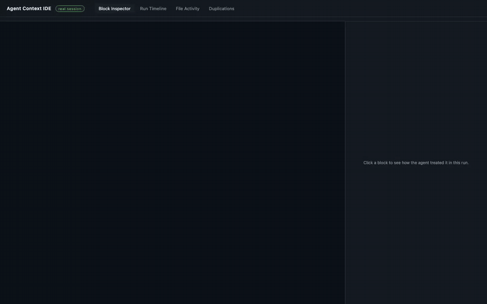

# Agent Context IDE

> [!WARNING]
> This project is still in a **prototype phase**. Interfaces, payload shapes and
> CLI behavior may change without notice.



A single-purpose tool that answers one question about a Claude Code session:
**"what context did the agent actually use on this turn?"**

It parses a real Claude Code transcript (`.jsonl` under `~/.claude/projects/<encoded-cwd>/`)
plus the relevant `CLAUDE.md` and skill files, and emits **one self-contained HTML file**
with all the data baked in. No server, no build system, no dependencies beyond the
Python 3 standard library. The tool never calls an LLM and never makes a network
request *at runtime* — its input is a transcript an agent already produced, and its
rule checks read a checks file authored (once, offline) with an LLM's help. Given
the same transcript and checks file, the output is fully reproducible with no model
in the loop.

## Table of contents

- [What it tells you](#what-it-tells-you)
- [Requirements](#requirements)
- [Quick start](#quick-start)
- [Installing the ctxlog hook](#installing-the-ctxlog-hook)
- [CLI reference](#cli-reference)
- [Query mode](#query-mode)
- [The HTML views](#the-html-views)
- [Block verdicts](#block-verdicts)
- [Rule checks: turning prose rules into checkable items](#rule-checks-turning-prose-rules-into-checkable-items)
- [Token attribution](#token-attribution)
- [Subagents](#subagents)
- [Example scenarios](#example-scenarios)
- [Constraints and design rules](#constraints-and-design-rules)
- [Repo layout](#repo-layout)
- [Tests](#tests)

## What it tells you

For every session, per turn (one real user prompt to the next):

- Which context files were in the model's window: global/project `CLAUDE.md`, skills,
  files the agent `Read`, `@path` references, hook-loaded files.
- A per-block verdict: was this rule/section **used**, **ignored** (rule violated),
  merely **possibly referenced**, **dormant**, **unused**, **undelivered** (truncated
  away before the model saw it), or **not loaded** at all.
- Where the tokens went: each API request's prompt tokens attributed across the
  context files that were resident for it, cached vs fresh, plus cache-break markers.
- Duplicated/overlapping content across context files, priced in attributed tokens.
- Every subagent the session spawned: the brief it was sent with, the result it
  reported back, runtime, tokens, and whether it ever returned.
- Rule violations with a citable span (file, line, matched text) — see
  [Rule checks](#rule-checks-turning-prose-rules-into-checkable-items).

## Requirements

- Python 3 (stdlib only — nothing to install to *run* the tool).
- Claude Code transcripts on disk (`~/.claude/projects/`). Run the tool from the
  project directory whose sessions you want to inspect: discovery encodes the
  current working directory to find the right transcript folder.
- Optional but recommended: the `ctxlog` hook (see
  [Installing the ctxlog hook](#installing-the-ctxlog-hook)). Sessions without it
  still work, but in a degraded mode: instruction-file loading falls back to path
  conventions, and compaction events are invisible (the hook is the only source of
  compaction boundaries, so without it there is no eviction accounting).

## Quick start

```bash
# Build the HTML for the most recent session in this cwd,
# writing ./agent-context-ide-real.html
python3 build_real_view.py

# List all sessions discoverable for this cwd
python3 build_real_view.py --list

# Pick a specific session by id prefix
python3 build_real_view.py --session abc12345

# Then open the output in a browser
open agent-context-ide-real.html
```

## Installing the ctxlog hook

[`hooks/ctxlog.py`](hooks/ctxlog.py) is a stdlib-only Claude Code hook that logs
what actually entered the model's context - instruction-file loads (with the load
reason), Read/Grep/Glob coverage including truncation detection, compaction
events, and subagent boundaries - to `~/.claude/ctxlog/<session_id>.jsonl`. This
project reads those logs (via `ctxlog_facts.py`) as ground truth; without them it
falls back to path conventions and cannot see compactions.

```bash
# Print the hook config to merge into ~/.claude/settings.json yourself
python3 hooks/ctxlog.py install

# Or let it merge for you (writes a .bak backup of settings.json first)
python3 hooks/ctxlog.py install --write
```

Restart Claude Code afterwards. The hook only covers sessions that run *after*
it is installed - existing transcripts stay in degraded mode. It is designed to
be safe: `collect` never writes to stdout (hook stdout on some events is fed
into the model's context - the very thing being measured), always exits 0, and
runs async with a 10s timeout so it can never stall a turn.

The script is also a standalone reader, independent of this project:

```bash
python3 hooks/ctxlog.py sessions      # list logged sessions, newest first
python3 hooks/ctxlog.py report [SID]  # timeline + coverage check for a session
```

## CLI reference

| Flag | Default | Meaning |
|---|---|---|
| `--transcript PATH` | none | Process one specific `.jsonl`, bypassing discovery. |
| `--session PREFIX` | most recent | Pick the active session by id prefix. |
| `--list` | off | List all discoverable sessions, then exit. |
| `--all-sessions` / `--no-all-sessions` | on | Bake multiple sessions into the HTML for in-browser switching. |
| `--max-sessions N` | 20 | Cap on sessions baked, most recent first. `0` = unlimited. |
| `--claude-md PATH` | `~/.claude/CLAUDE.md` | Global CLAUDE.md location. |
| `--project-claude-md PATH` | `./CLAUDE.md` | Project CLAUDE.md location. |
| `--skills-dir PATH` | `~/.claude/skills` | Skills directory. |
| `--projects-dir PATH` | `~/.claude/projects` | Transcript discovery root. |
| `--out PATH` | `./agent-context-ide-real.html` | Output HTML path. |
| `--compare A B` | off | Bake a Compare tab for two sessions (id prefixes). Without it, no compare payload exists at all. |
| `--query ADDRESS…` | off | Read-only plain-text query instead of an HTML build (see below). |
| `--field NAME` | none | With `--query`: print one field in full, unbounded. Block: `title/status/reason/content/moments`; agent: `prompt/result`; session/turn: `prompt`. |
| `--all` | off | With `--query`: print every listing row instead of the first 60. |

## Query mode

`--query` answers in plain text, reads the same baked JSON the page renders, writes
nothing, and never opens a browser. Every listing prints the ids the next query
needs, so three commands take you from zero knowledge to one block's verdict.
Anything elided (fields cap ~1500 chars, listings at 60 rows) prints the exact
command that returns the rest.

Address grammar:

```
sessions
<session-id-prefix> [turn-N] [turns | files | blocks | agents
                             | <file-id> | <block-id> | agent-<id>]
```

Typical drill:

```bash
# 1. every session: id, when, turns, tokens, prompt preview
python3 build_real_view.py --query sessions

# 2. what happened in one session, and what was in context
python3 build_real_view.py --query abc12345 turns
python3 build_real_view.py --query abc12345 turn-2 blocks
python3 build_real_view.py --query abc12345 turn-2 files
python3 build_real_view.py --query abc12345 turn-2 agents

# 3. one block's verdict, reason, rule-check findings and moments
python3 build_real_view.py --query abc12345 users-jakuburban-claude-claude-md-0-how-to-talk-to-me

# a field in full
python3 build_real_view.py --query abc12345 <block-id> --field content
```

Notes:

- Session prefixes must be unambiguous; an ambiguous prefix is refused.
- A leaf token resolves as block id first, then file id; `agent-` addresses a
  subagent run but still falls through, so a real file named `agent-foo.md`
  stays reachable.
- A block's output includes its `rule` line: rule-check state, findings with
  file/line/matched text, and why a rule could not be checked.
- An agent's output includes the two fields no other view shows: the `brief`
  the main agent wrote and the `result` that came back.

## The HTML views

Five tabs, all rendering the same baked JSON:

- **Block Inspector** — the main view. Navigates by drilling: sessions → turns →
  files → blocks, one level per click, with a breadcrumb and deep-linkable hash
  (`#s=&t=&a=&f=&b=`). Subagents hang off their turn as peers of files. Files and
  blocks render in an Active group above a Quiet one. The detail pane for a block
  shows its content, verdict + reason, rule-check findings, attributed cost
  (labelled estimated), near-duplicates, evidence, and the chronological
  TRIGGER → INTENT → ACTION → OUTCOME "moments" cards.
- **Run Timeline** — filterable event list, including compaction and cache-break
  marker rows.
- **File Activity** — reads/edits per file across the scope.
- **Duplications** — overlapping context content, classified
  `redundant` / `overlap` / `related`, priced by attributed tokens (the share
  that could have been deleted).
- **Compare** — only when built with `--compare A B`. Aligns the two sessions'
  tool-call sequences by content (difflib), never by index, and shows
  paired/unpaired steps plus deltas.

## Block verdicts

Every `CLAUDE.md`/skill block gets one of 8 statuses in two families:

- **USED**: `used`, `used-partial`, `possibly-referenced`, `ignored`
- **NOT-USED**: `undelivered`, `unused`, `dormant`, `not-loaded`

Evidence is tiered. **Strong** evidence ties the block to a specific observable
outcome (a trigger the user actually typed, a path-table row whose command also
ran, a satisfied response-shape rule) and is the only tier that can produce
`used`, `used-partial` or `ignored`. **Weak** evidence (bare command mentions,
loose keyword overlap) tops out at `possibly-referenced` and never reaches green.

Delivery is checked before anything is scored: a block the model never saw
(truncated tail, a gap between disjoint read ranges) is `undelivered`, never
"unused" — the difference between *never arrived* and *arrived and ignored*.

Session-scope verdicts combine per-turn ones with the invariant "used in any
turn → used at session scope", and `ignored` always stays visible.

## Rule checks: turning prose rules into checkable items

The only mechanism that may call a rule **violated**. The tool never interprets
prose at runtime — interpretation happens exactly once, offline, at authoring time:

1. **Author** (manual): run [`prompts/translate-rules.md`](prompts/translate-rules.md)
   over a guidelines doc in a Claude session and commit the JSON it returns as
   `<doc>.checks.json` beside the doc. The prompt is built to refuse: rules that
   need judgment, cross-file context, types, or runtime info go to `not_checkable`
   with a reason. Expect a high refusal rate (~69% on the pilot docs) — that is
   the design working. A false violation is treated as much worse than a missed one.
2. **Closed vocabulary**: each check is one of 8 kinds —
   `forbidden_pattern`, `required_pattern`, `forbidden_co_occurrence`,
   `required_co_occurrence`, `required_order`, `forbidden_command`,
   `required_command`, `forbidden_path` — with regex pattern fields,
   `applies_to` globs, `confidence` (high/medium/low), a `message`, an optional
   `rule_key` (hash of the rule text; if the rule is later edited the check is
   skipped as stale), and a **mandatory `self_test`** with both `should_match`
   and `should_not_match` snippets.
3. **Load-time enforcement** (`rule_checks.py`): self-tests are re-run with this
   tool's own matcher and any failing check is refused (a generator's claim that
   its tests pass is not evidence). Comments and string literals are stripped
   centrally, offset-preserving, before any pattern runs. A `violated` state
   requires the pattern to fire on **both** the raw and the stripped text;
   disagreement is `unclear`, never a violation. An inline `ctx-allow`
   (or `ctx-allow: <check-id>`) marker on the match's line or the line above
   downgrades a hit to `acknowledged`.
4. **Block states**: `violated` / `acknowledged` / `unclear` / `clear`
   (checks ran over in-scope code, found nothing) / `not-exercised` (session
   wrote nothing the checks apply to — deliberately distinct from "followed") /
   `not-checkable`. Only a `violated` finding with high/medium confidence turns
   a block red (`ignored`), citing file, line and matched text.
5. **Fallback**: a guidelines doc with no checks file gets a narrow mechanical
   extraction (negation cue + backticked code-shaped token, max 5 checks),
   always `confidence: low`, which can never redden a block. Files the agent
   merely read get no rule treatment at all.

Example: the rule *"Never combine observer() and memo() on the same component"*
becomes a `forbidden_co_occurrence` check with patterns `observer\(` and
`\bmemo\(`, scoped to `**/*.tsx`, whose self-tests cover the comment,
string-literal and longer-identifier false-positive cases.

A checks file is trusted repo content: its patterns run as written, with no
timeout, so review a generated one before committing it.

## Token attribution

Headline numbers come only from the `usage` object on assistant events, deduped
per API request (`message.id`). Each request's prompt tokens are split across
the context items resident for it, proportionally by character size, plus a
history bucket sized by the conversation prefix, so file figures aren't inflated
by chat growth. Rounding uses largest-remainder so parts always sum back exactly.
Files evicted by a compaction stop accruing from that request onward. Per-block
figures divide a file's cost by line share and always carry `estimated: true`.

## Subagents

Every `Agent`/`Task`/`Workflow` spawn is paired to its report-back notification
by tool-use id (name fallback). One spawn can report more than once; a second
notification appends to the same agent. Lanes and colors are computed in Python
and baked, so an agent that never returned keeps its lane visibly to session end.
The subagent's own transcript is named but deliberately never read (it can be
tens of MB); all counts are main-thread spawns only.

## Example scenarios

**1. "Did Claude follow my CLAUDE.md rule — and if not, where?"**
You added a rule "never combine observer() and memo()" to the project CLAUDE.md,
authored a checks file for it, and suspect a recent session broke it anyway.

```bash
python3 build_real_view.py --query sessions            # find the session
python3 build_real_view.py --query abc12345 blocks     # spot the [ignored] block
python3 build_real_view.py --query abc12345 <block-id> # verdict + rule line
```

The block's output cites the exact file, line and matched text where the check
fired — or tells you the rule was `not-exercised` (the session never wrote a
`.tsx` file) or `undelivered` (the block was truncated out of context before the
model could see it), which are very different problems from "Claude ignored me".

**2. "Why is this project's context so expensive, and what can I delete?"**
Sessions feel slow and token-heavy. Build the HTML, open the Block Inspector at
session scope, and sort by what the attribution says: which files are resent on
every request and what they cost cached vs fresh. Then open the **Duplications**
tab: pairs classified `redundant` carry an overlapping-token figure — the share
of the cheaper side that could have been deleted outright. Cross-check with
verdicts: a block that is `dormant` or `unused` across every session while
costing thousands of attributed tokens per request is a strong deletion
candidate; one that is `used` on the turns that matter earns its cost.

## Constraints and design rules

- **Stdlib-only.** No dependencies, ever.
- **No LLM calls, no network.** Rule interpretation happens at authoring time;
  the tool only reads the checked-in JSON.
- **One self-contained HTML file.** All UI lives inside `HTML_TEMPLATE` in the
  script; it is never split out.
- **Everything the UI shows is computed in Python and baked.** The JS renders
  the payload; it never derives data, so `--query` and the page can never
  disagree about the same session.
- **The JSON payload is the stable contract, the HTML is not.** Payload changes
  are additive-only, enforced by a golden-payload test. Block and file ids are
  stable across runs — they are deep-link addresses.
- Headline token numbers come only from `usage`; char-count estimates must be
  labelled as estimates.

## Repo layout

| Path | What it is |
|---|---|
| `build_real_view.py` | The tool (~7k lines): parser, assessors, query mode, HTML emitter. |
| `rule_checks.py` | Compiled rule checking: loads/validates checks files, strips comments, evaluates. |
| `ctxlog_facts.py` | Hook-log parser: "actually loaded" facts that override path conventions. |
| `hooks/ctxlog.py` | The hook that writes those logs. Self-installing (`install --write`); also a standalone session reporter. |
| `prompts/translate-rules.md` | The authoring prompt that turns a guidelines doc into a checks file. |
| `CLAUDE.md` | The detailed architecture map (canonical for contributors). |
| `agent-context-ide-prototype.html` | Hand-written static mockup. Layout reference only; not generated. |
| `agent-context-ide-real.html` | The script's output. Build artifact — regenerate, don't edit. |
| `tests/` | Pytest suite (~357 tests, 16 modules). |

## Tests

```bash
# bare `pytest` from the repo root (pytest is not installed for the default
# python3 on this machine; use the venv if `pytest` isn't on PATH)
pytest
```

Tests assert on the baked JSON payload via in-memory event builders defined in
`tests/test_turns.py` — never on HTML strings, because the template is not a
stable contract. Verifying a change means `pytest` green *and* regenerating the
HTML and opening it.
